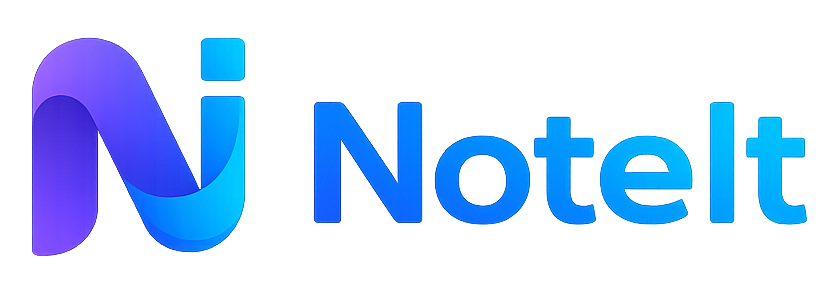

# NoteIt 📝

A fast, beautiful, and fully local desktop notes app for Windows. Rich text editing, screenshots, Pomodoro timer, encryption, and more – all without an internet connection.



## Features

- 🖥️ **System Tray** – runs in the background, always accessible
- 🚀 **Autostart** – launches automatically with Windows
- 📝 **Rich Text Editor** – bold, italic, headings, lists, checklists, tables, code blocks, quotes, horizontal rules
- 🎨 **Colors & Highlights** – text colors, highlight markers, note card colors
- 📸 **Screenshots** – global shortcuts to capture screen areas to notes or clipboard
- 🔒 **Encryption** – PIN-lock individual notes
- 🏷️ **Tags** – up to 3 tags per note for filtering
- 📋 **Kanban Board** – drag & drop notes between To do / In progress / Done
- ⏱️ **Pomodoro Timer** – work/break sessions with mini always-on-top mode
- 🔔 **Reminders** – set date/time reminders with desktop notifications
- 📌 **Sticky Notes** – pin notes to the desktop as floating widgets
- 🗂️ **Subnotes** – hierarchical note structure with breadcrumbs
- 🔗 **Note Links** – link between notes for quick navigation
- 📦 **Import / Export** – import `.md`/`.txt`/`.zip`, export `.zip` with metadata or single `.md`
- 🔍 **Search** – main search bar, Command Palette (Ctrl+P), Find & Replace (Ctrl+F)
- 📄 **Templates** – Empty, Meeting, Task list, Journal, Project, Brainstorm
- 🗑️ **Trash** – soft delete with 30-day retention, restore, permanent delete
- 🌐 **Multilingual** – English and Polish
- 🔐 **Privacy** – 100% local, no internet, no tracking

## Installation & Development

```bash
# Install dependencies
npm install

# Run in development mode
npm run dev

# Build the application (.exe)
npm run build
```

### Development Mode

The `npm run dev` command starts both the Vite dev server (renderer) and the Electron main process concurrently.

## Tech Stack

| Technology | Purpose |
|-----------|---------|
| Electron 28 | Desktop application framework |
| React 18 | UI library |
| TypeScript | Type-safe development |
| Tiptap | Rich text editor (ProseMirror-based) |
| Vite | Frontend bundler & dev server |
| electron-store | Local data persistence |

## Keyboard Shortcuts

### Global (from any application)

| Shortcut | Action |
|----------|--------|
| Ctrl+Q | Open all notes |
| Ctrl+Shift+Q | Open last edited note |
| Ctrl+Shift+S | Screenshot → note |
| Ctrl+Shift+C | Screenshot → clipboard |
| Ctrl+Shift+V | Clipboard text → new note |

### Notes List

| Shortcut | Action |
|----------|--------|
| Ctrl+N | New note |
| Ctrl+P | Command palette |
| Ctrl+K | Keyboard shortcuts |

### Editor

| Shortcut | Action |
|----------|--------|
| Ctrl+B | Bold |
| Ctrl+I | Italic |
| Ctrl+Shift+X | Strikethrough |
| Ctrl+E | Inline code |
| Ctrl+Alt+1/2/3 | Heading 1/2/3 |
| Ctrl+Shift+8 | Bullet list |
| Ctrl+Shift+7 | Ordered list |
| Ctrl+Shift+9 | Checklist |
| Ctrl+Shift+B | Blockquote |
| Ctrl+Z | Undo |
| Ctrl+Shift+Z | Redo |
| Ctrl+F | Find & Replace |
| / | Slash commands |
| Ctrl+V | Paste image |

## Documentation

For a complete user guide, see [USER_GUIDE_EN.md](USER_GUIDE_EN.md) (English) or [USER_GUIDE_PL.md](USER_GUIDE_PL.md) (Polish).

## License

MIT License © 2026 [The Cloudest - Tomasz Iwanowski](https://github.com/tiwanowski96)

See [LICENSE](LICENSE) for details.

## AI-Assisted Development

This application and its documentation were built with the assistance of AI (Kiro / Claude).
